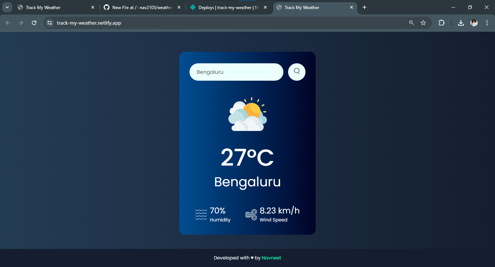

# Track My Weather ☁️☀️🌥️🌦️❄️

A simple weather application that provides current weather information for any city using the OpenWeatherMap API. The application is built using HTML, CSS, and JavaScript, and is designed to be mobile responsive.

🔗Live link - [Track My Weather](https://track-my-weather.netlify.app/)

## Features

- Search for current weather by city name.
- Display temperature, humidity, wind speed, and weather conditions.
- Responsive design for both desktop and mobile devices.

## Demo



## Technologies Used

- HTML
- CSS
- JavaScript
- [OpenWeatherMap API](https://openweathermap.org/api)

## Getting Started

### Prerequisites

To run this project, you need a basic understanding of HTML, CSS, and JavaScript.

### Installation

1. Clone the repository:
    ```bash
    git clone https://github.com/nav2103/weather-app.git
    cd weather-app
    ```

2. Open the project directory in your favorite code editor.

3. Create an account on [OpenWeatherMap](https://openweathermap.org/) to get an API key.

4. Replace the `apiKey` variable in `script.js` with your OpenWeatherMap API key:
    ```javascript
    const apiKey = "YOUR_API_KEY_HERE";
    ```

5. Open `index.html` in your browser to view the application.

## Usage

1. Enter the name of a city in the search box.
2. Click the search button or press Enter.
3. The application will display the current weather for the specified city.

## Responsive Design

The application is designed to be responsive and works well on different screen sizes. Below are some of the responsive features:

- Adjusted font sizes and icon sizes for tablets and smartphones.
- Flexbox layout adjustments for better readability on smaller screens.

## Author

Developed with ❤️ by [Navneet](https://www.linkedin.com/in/navneetsingh03/)

## Contributing

Contributions are welcome! Please open an issue or submit a pull request for any improvements or bug fixes.

## Acknowledgements

- [Poppins Font](https://fonts.google.com/specimen/Poppins)
- [OpenWeatherMap API](https://openweathermap.org/api)
